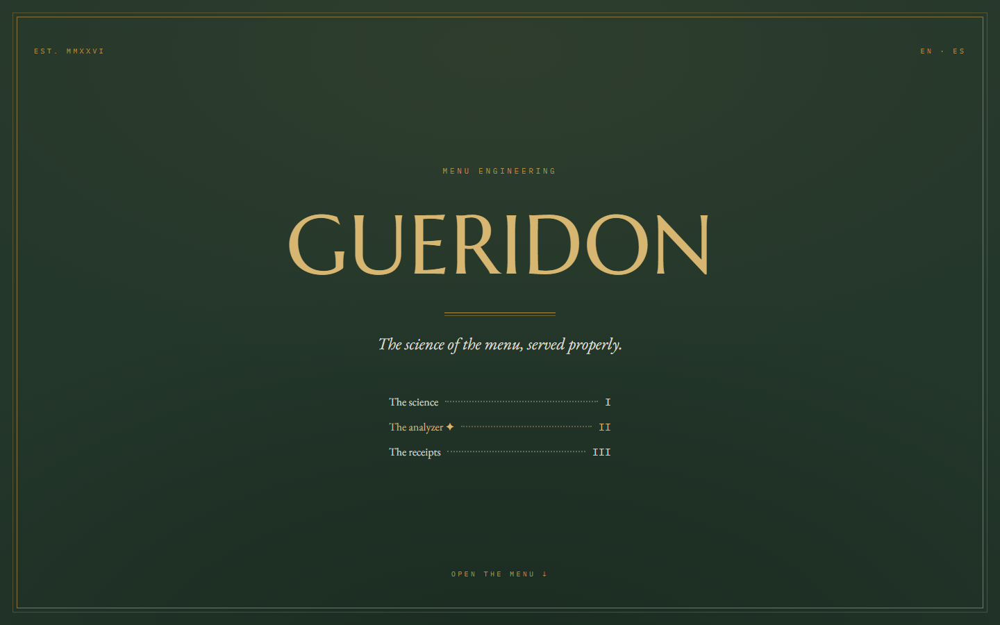
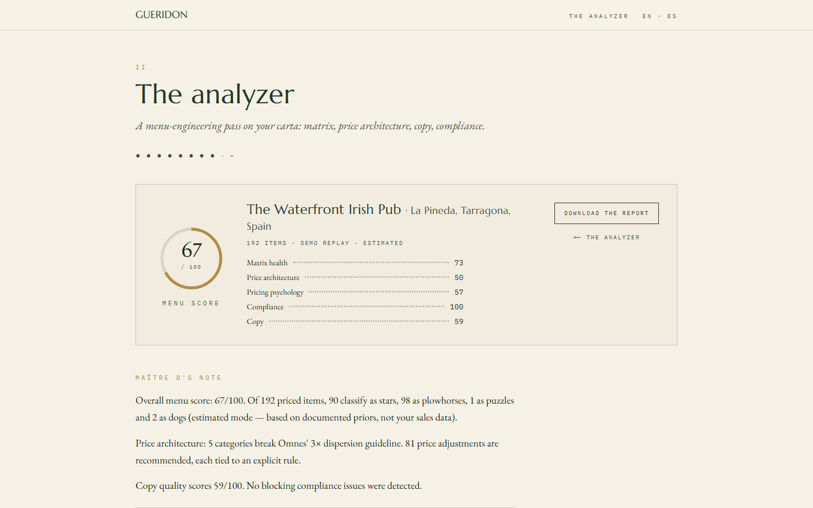
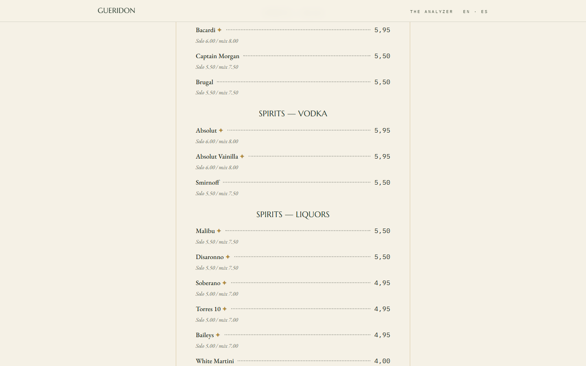

# Gueridon — the science of the menu, served properly

[](https://github.com/Arekusumt/gueridon/actions/workflows/ci.yml)
[](tests)
[-89%20%C2%B7%20100%20%C2%B7%20100%20%C2%B7%20100-5c62d6)](lighthouse-prod.json)
[](https://gueridon.vercel.app)
[](LICENSE)

**Live:** https://gueridon.vercel.app · EN/ES

A long-form, luxury-typography explainer of **menu engineering** — every claim backed by
verified research — with a working **menu analyzer** built in: upload a carta, get the
Kasavana–Smith matrix, rule-based price moves, copy doctoring, legal compliance checks,
a what-if simulator and a print-ready redesigned menu.

| The cover | The analyzer | The redesign |
|---|---|---|
|  |  |  |

## Why this exists

Most restaurants agonise over the food and photocopy the menu — yet the menu is the only
advertisement every guest reads, at the exact moment of decision. Gueridon explains the
discipline (the matrix, price architecture, scanning research, copy, room psychology,
the fine print) and then applies it, live, to your own menu.

## The architecture argument

The design rule of the codebase: **every number the app reports comes from a
deterministic, unit-tested engine; the LLM only does what math can't.**

```
                    ┌─────────────────────────────────────────┐
 menu photo/text ──▶│  lib/pipeline  (agentic shell, SSE)      │
                    │  parse → normalize → estimate →          │
                    │  competitors → pricing → doctor →        │
                    │  compliance → report                     │
                    └───────────────┬─────────────────────────┘
                                    │ calls, never overrides
                    ┌───────────────▼─────────────────────────┐
                    │  lib/engine  (deterministic core)        │
                    │  matrix.ts  omnes.ts  pricing.ts         │
                    │  compliance.ts  elasticity.ts  scoring.ts│
                    │  — pure TypeScript, fully unit-tested —  │
                    └─────────────────────────────────────────┘
```

- **Deterministic core** — Kasavana–Smith classification with Pavesic's demand-weighted
  margin, Omnes price-structure rules, left-digit/round-number price psychology with
  machine-readable reason codes, EU-1169/2011 + Catalan drink-promo + tap-water law
  checks, constant-elasticity what-if simulation, and a weighted 0–100 menu score.
- **Agentic shell** — Claude reads menu photos, refines cost/popularity estimates within
  schema bounds (zod-validated at the trust boundary), audits copy and writes the prose.
  Each stage streams over SSE so the UI shows the pipeline working live.
- **Every LLM stage has a deterministic fallback**, so the entire product runs — and is
  end-to-end tested — with zero API calls: pasted menus are parsed by a layout-aware text
  parser, estimates come from documented priors (always labelled *estimated*), and the
  report is templated from engine numbers.

Stage-by-stage internals (trust boundary, fallbacks, model routing, SSE events) are in
[`docs/pipeline.md`](docs/pipeline.md); the reasoning behind the name, the architecture
and the API posture is logged in [`docs/decisions.md`](docs/decisions.md).

## Modes

| Mode | When | Cost |
|---|---|---|
| **Demo** | one click — precomputed from the real printed menus of The Waterfront Irish Pub (La Pineda), published with the owner's permission | free |
| **Deterministic** | paste a menu as text, no key anywhere | free |
| **Live** | `ANTHROPIC_API_KEY` set server-side (per-visitor daily cap) or a BYO key per request (never stored, never logged) | ~cents per analysis |

## Research honesty

The editorial half cites **28 verified sources** — verified as in: primary text or
publisher record located, figures cross-checked, and the caveats kept in the copy.
The golden triangle is presented with the eye-tracking evidence *against* it (Yang 2012);
choice overload is presented as conditional (Iyengar & Lepper 2000 *vs* Scheibehenne
et al. 2010); Wansink's famous +27% carries its context. Where a rule is trade doctrine
rather than a paper (Omnes), it is labelled as such. The full bibliography renders as
"The receipts" on the site, from [`content/research/bibliography.json`](content/research/bibliography.json).

## Run it locally

```bash
npm install
npm run dev        # http://localhost:3000/en

npm test           # vitest — engine + pipeline (38 tests)
npm run e2e        # Playwright smoke: demo flow, i18n, mobile, paint checks
```

No environment variables required. Optional: `ANTHROPIC_API_KEY` (live mode),
`GUERIDON_RL_SECRET` (rate-limit cookie signing), `GUERIDON_MODEL_FAST/SMART`
(model overrides).

## Stack

Next.js 16 (App Router) · TypeScript · Tailwind v4 · @anthropic-ai/sdk · zod ·
vitest · Playwright · CI on GitHub Actions. Type set in Marcellus, EB Garamond and
IBM Plex Mono; the dot-leader is the house signature.

## Honest limitations

- Without your sales/cost data the matrix runs in **estimated mode** on documented
  priors — directional, clearly labelled, never presented as your books.
- Market benchmarks are aggregated from cited public sources (dataset in
  [`data/market/`](data/market/)) — for directional benchmarking only.
- The what-if simulator is a constant-elasticity scenario tool, not a forecast.
- Nothing here is legal or financial advice.

## The Gradian ecosystem

Gueridon doubles as the **menu-audit lead magnet** of [Gradian](https://gradiangrowth.com),
a digital-growth studio for local businesses. Sibling public projects:

- [gradian-sistema](https://github.com/Arekusumt/gradian-sistema) — the agentic system map
  behind the studio (28 agents, 90 nodes).
- [gradian-caso-waterfront](https://github.com/Arekusumt/gradian-caso-waterfront) — the
  public case study of the pub whose real menus power this demo.
- [gradian-match](https://github.com/Arekusumt/gradian-match) — agentic CV/job-matching
  tool with a live pipeline view, Gueridon's methodological sibling.

---

Built in one (long) night by [Alex](https://github.com/Arekusumt) with Claude Code, as
part of the [Gradian](https://gradiangrowth.com) ecosystem. Source-available — see
[LICENSE](LICENSE).
